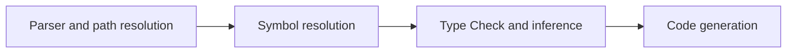

For now we have 4 sequential stages

- [Parse and path resolution](./01-Parser.md)
- [Symbol resolution](./02-SymbolResolution.md)
- [Type check and inference](./03-TypeCheckAndInference.md)
- [Code generation](./04-CodeGeneration.md)

Every stage is completed before the next one starts. This means that for big
compilation project the memory usage is going to spike. Since a big project in
this language is something very far in the future that's okay for now.

After the completion of the mvp and stabilization of the language we plan to
make this stages in parallel. This is also a required step to get good support
for the lsp.
