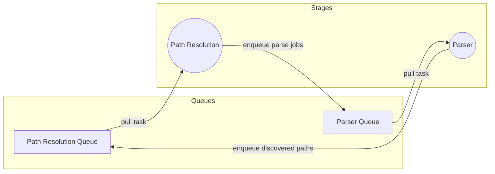

# Parser

The haskell parser consist of parser combinators.

We developed our own lib of parser combinators that use the effectful library
instead of MTL.

The main reason for that is that megaparsec marks as "expensive" the calls for
source position. For now we don't support incremental compilation and as such
the CST is annotated with the source position. This means that we query the
source position at every token (we do it twice in fact).

# Path resolution

For now, the project is young and we don't have a package manager but we want to
do as in rust and use the package level as the minimum compilation unit instead
of per file as in haskell. This means that inline of functions of a package can
be done anywhere in the same package with ease. Also, this enable us to allow us
to define instances of type classes in the same package but in a different
module that the one of that define the class or the type, this can become very
useful in some sceneries.

# Why conflate both?

Before we proceed to type check we want to have all the symbols resolved in a
module, to do that we need to figure out first all the dependencies of the
module, so on. In order to simplify it for now, we do the stages in sequence.

To get the dependencies (imports) of a module, we need to parse it first.
Instead of parsing the module twice, one for imports and one for real parsing,
we store the full cst.

Once we have the imports we can add the not yet discovered modules to the list
of modules to find in the system and parse when found. This means the path
resolution (module level dependency tree) and the parsing would mutually add
work for each other until there are not more work to be done. As such we choose
to compact this on a single stage for now.

We expect the end result when we parallelize the compiler to be quite similar to
this

# Information required by parser

- The file to parse

# Information required by the path resolution

- A collection of path were to lookup for a file
- A collection of paths to lookup

# Stage Output

At the end of the this stage we have 2 possible states:

- An error occurred on at some point and we continued as much as possible in
  that state, it means the result is unreliable and we should report as many
  errors as we found.
- We found and parsed every required module, we constructed a module dependency
  tree and have the CST for every module.

We cannot solve names (symbols/identifier etc) at this point since we parsed the
module before it's dependencies, and we cannot assign the dependency route to
them. This can be fixed if we replace every symbol in a module with a unique id
and build a table of symbols for the module, delaying the resolution of imported
symbols for later. This complicates the process and conflates the parsed with
it. As such we choose to not do this (we did and wasn't worth the effort).

# Checks done by this stage

- Every module needed exists
- Every module has a correct syntax
